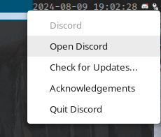

### Description
Add a system tray next to the [bar](https://codeberg.org/dwl/dwl-patches/src/branch/main/patches/bar). Heed the warning, this is far from suckless ^^

### Dependencies
- GTK4
- [bar.patch](https://codeberg.org/dwl/dwl-patches/src/branch/main/patches/bar) as mentioned.
- [gtk4-layer-shell](https://github.com/wmww/gtk4-layer-shell)
- [statusnotifier-systray-gtk4](https://codeberg.org/janetski/statusnotifier-systray-gtk4) built as a static library.

### Applying the patch
The patch applies on top of the bar patch. That needs to be applied first.

The patch creates subdirectories `lib` and `include`. After patching, but before `make`, install
`libstatusnotifier-systray-gtk4.a` and `snsystray.h` from statusnotifier-systray-gtk4 in the
directories. One possible way to do that:

1. Clone [https://codeberg.org/janetski/statusnotifier-systray-gtk4](https://codeberg.org/janetski/statusnotifier-systray-gtk4). Can clone to any location.
2. From statusnotifier-systray-gtk4 root:
    1. `$ meson setup --default-library=static --prefix=/ -Dgir=false -Dvala=false -Ddocs=false build`
    2. `$ meson compile -C build`
    3. `$ DESTDIR=$DWLDIR meson install -C build`, where $DWLDIR is the path to dwl root.
3. Finally, from dwl root, run `make`.

### Download
- [git branch](/janetski/dwl/src/branch/0.7-systray)
- [0.7](/dwl/dwl-patches/raw/branch/main/patches/bar-systray/bar-systray-0.7.patch)

### Authors
- [janetski](https://codeberg.org/janetski) ([.vetu](https://discordapp.com/users/355488216469471242) on discord)
